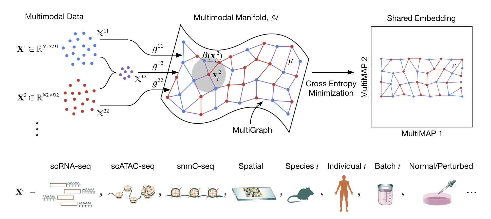

# MultiMAP
**MultiMAP** is a method for integrating single cell multi-omics. MultiMAP can also be used for batch correction. More detail is available in our [preprint](https://www.biorxiv.org/content/10.1101/2021.02.16.431421v1).

<p align="center"></p>


## Installation

We're working on getting the package on `pip` ASAP. Meanwhile enjoy this placeholder solution!

```
git clone https://github.com/Teichlab/MultiMAP.git
cd MultiMAP
pip3 install .
```

## Usage and Documentation

MultiMAP offers two functions accepting AnnData objects on input:
	- `MultiMAP.Integration()` expects a list of one AnnData per dataset, with the desired dimensionality reduction precomputed and stored in `.obsm`. This allows for refining the initial dimensionality reduction, e.g. if wishing to use `TFIDF_LSI` for ATAC data and PCA for RNA data.
	- `MultiMAP.Batch()` expects a single AnnData object with the dataset information stored in an `.obs` column. This allows for convenient integration with minimal preparation if all datasets can be treated with the same dimensionality reduction.
There's also an AnnData-independent `MultiMAP.matrix.MultiMAP()` function which operates directly on dimensionality reduction matrices.

A tutorial covering both RNA-ATAC integration and RNA-Seq batch correction use can be found [here](https://nbviewer.jupyter.org/github/Teichlab/MultiMAP/blob/master/examples/tutorial.ipynb).

Documentation of the function parameters can be found on [ReadTheDocs](https://multimap.readthedocs.io/en/latest/).

## Citation

If your work uses MultiMAP, please cite the [paper](https://www.biorxiv.org/content/10.1101/2021.02.16.431421v1):

	@article{sarkinjain2021multimap,
	  title={MultiMAP: Dimensionality Reduction and Integration of Multimodal Data},
	  author={Sarkin Jain, Mika and Dominguez Conde, Cecilia and Polanski, Krzysztof and Chen, Xi and Park, Jongeun and Botting, Rachel 
	  and Stephenson, Emily  and Haniffa, Muzlifah and Lamacraft, Austen and Efremova, Mirjana and Teichmann, Sarah},
	  doi={https://doi.org/10.1101/2021.02.16.431421},
	  journal={BioRxiv},
	  year={2021}
	}

## Contact

Mika Sarkin Jain - mikasarkinjain@gmail.com \
Mirjana Efremova -  m.efremova@qmul.ac.uk \
Sarah Teichmann - st9@sanger.ac.uk
